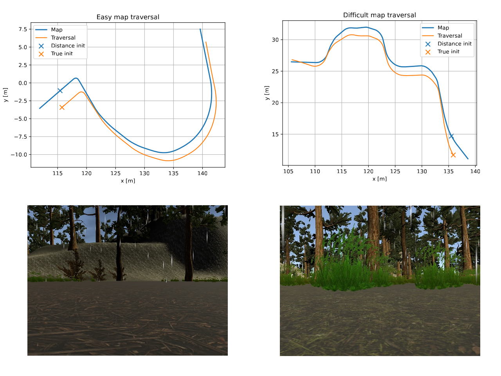

# Visual Teach and Repeat Simulator Workspace
Workspace for unity based simulator of VTR. Currently simulating Jackal robot with front camera in changing environment. \
The simulator used for this workspace is from [this](https://github.com/MrTomzor/navigation_unity_testbed) repository (big thanks to MrTomzor). \
All other dependecies are added via submodules or available through apt (see src folder).

## Initialization
- Clone this repository and don't forget to fetch the submodules `git submodule init && git submodule update`.
- Download built binaries [here](https://github.com/MrTomzor/navigation_unity_testbed) (see readme and releases) and put it into the `sim_build` folder.
- Build the workspace using `cd ws && catkin b`
- Use the script `sim_tmux.sh` to start the simulation.
- Attach to tmux session `tmux a -t simulator` to control the simulation.
- You should manually run the `support.launch` (3rd tmux pane) to resize camera, publish odometry and enable control (with attached ps4 controller).
- There is tmux session in `pfvtr` submodule tailored specifically for the simulator `start_sim.sh`.

# Learning Control Policy for Visual Teach and Repeat
This repository was used for the paper submitted to ICRA 2025. We used RL to train a control policy enabling the robot to traverse a previously mapped path.
The implementation of VT&R with an integrated NN controller used for the real-world experiment can be found [here](https://github.com/Zdeeno/pfvtr).
Image below shows repeated trajectories and camera images from the maps.

